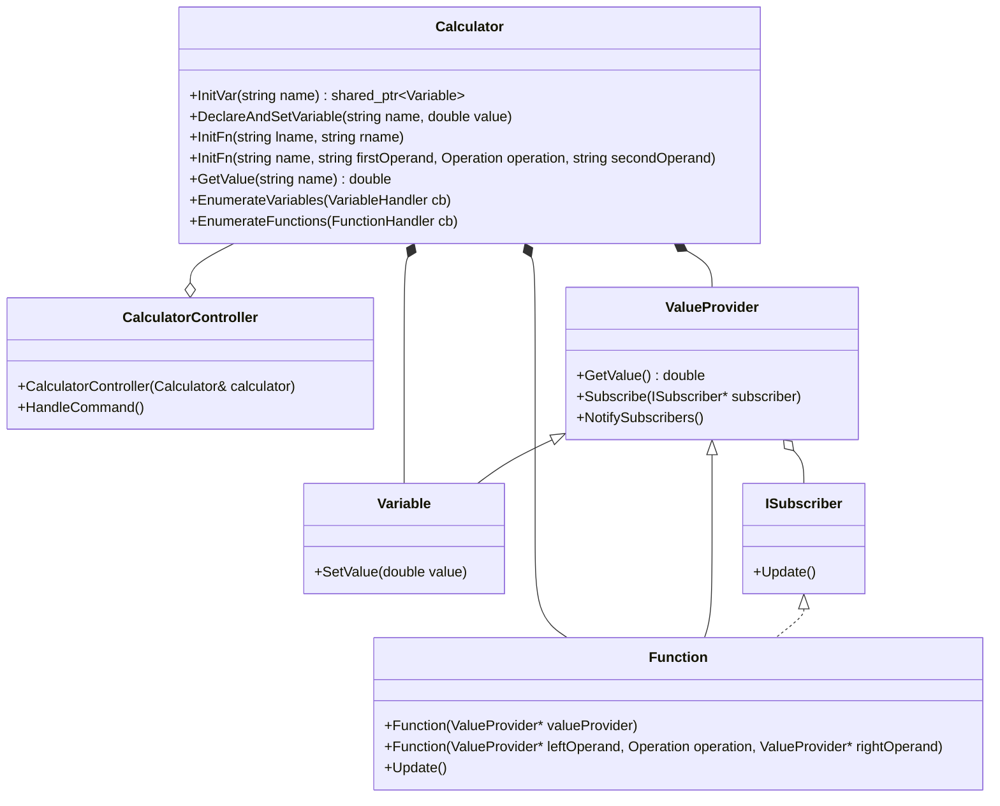

```mermaid
classDiagram
    class CalculatorController {
        +CalculatorController(Calculator& calculator)
        +HandleCommand()
    }

    Calculator --o CalculatorController

    class Calculator {
        +InitVar(string name) shared_ptr~Variable~
        +DeclareAndSetVariable(string name, double value)
        +InitFn(string lname, string rname)
        +InitFn(string name, string firstOperand, Operation operation, string secondOperand)
        +GetValue(string name) double
        +EnumerateVariables(VariableHandler cb)
        +EnumerateFunctions(FunctionHandler cb)
    }

    Calculator *-- ValueProvider
    Calculator *-- Variable
    Calculator *-- Function

    class ValueProvider {
        +GetValue() double
        +Subscribe(ISubscriber* subscriber)
        +NotifySubscribers()
    }

    class ISubscriber {
        +Update()
    }

    ValueProvider o-- ISubscriber
    ValueProvider <|-- Variable

    class Variable {
        +SetValue(double value)
    }

    ValueProvider <|-- Function
    ISubscriber <|.. Function

    class Function {
        +Function(ValueProvider* valueProvider)
        +Function(ValueProvider* leftOperand, Operation operation, ValueProvider* rightOperand)
        +Update()
    }
```